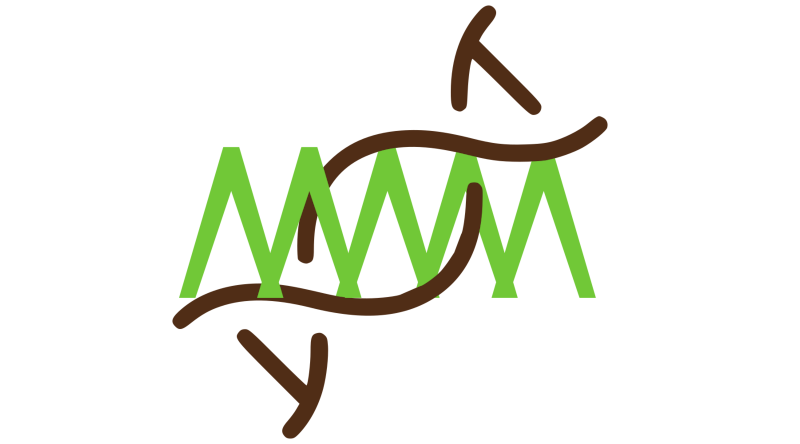
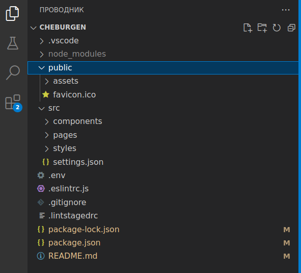

<div style="display: none">
	<a href="https://yababay.github.io/cheburgen/">Образец сгенерированного сайта</a>
</div>



# Cheburgen: SSR/SSG сервер


## Обзор современных веб-технологий

Современный подход к веб-разработке предполагает слабое участие сервера в визуализации контента. Он в основном занят формированием абстрактных данных и передачей их клиенту в соответствии с концепциями `REST-API/CRUD` в форматах `json`, `xml` и т.п. Формированием динамического внешнего вида веб-страницы занимается, в основном, сам браузер. Именно на организацию такого его поведения направлены современные фреймворки (`Angular`, `React`, `Vue`, `Svelt` и другие). Фреймворки позволяют создавать многократно используемые компоненты, обеспечивают реактивность во взаимодействии с пользователем, могут корректировать внешний вид с помощью встроенных `css`-инструментов. 

Разработка с помощью фреймворков завоевала большую популярность, но у нее есть существенный недостаток. С точки зрения поисковой оптимизации (SEO) такие страницы выглядят абсолютно пустыми. Например, можно написать сколь угодно богатое возможностями интерактивное `React`-приложение, "обернув" его вокруг корневого элемента, но поисковые машины увидят лишь

```html
<div id="root"></div>
```

Такой сайт вряд ли займет высокие позиции в рейтингах `Google`, `Яндекс` и других кравлеров. А вот такая веб-страница продвинется гораздо выше:

```html
<h1>Пирожки на Казанском вокзале</h1>
<ul>
	<li>с капустой - 20 руб.</li>
	<li>с повидлом - 30 руб.</li>
	<li>с ливером - 45 руб.</li>
</ul>
```

Однако писать на чистом `html` утомительно. Задействовать многократно используемые компоненты при таком подходе можно лишь копируя их в редакторе через буфер обмена. Именно поэтому сохраняет популярность технология [`MVC`](https://ru.wikipedia.org/wiki/Model-View-Controller), когда `html`-документы формируются на стороне сервера, который при необходимости инжектирует в них данные. В качестве примеров можно привести  `CGI`, `PHP`, `ASP`, `JSP` и т.д.

У `MVC`-продуктов есть, однако, существенный недостаток: при переключении со страницы на страницу конечный пользователь видит на доли секунды белый экран (`white flash`). Поэтому для человеческого зрения комфортнее приложения в формате `SPA (Single Page Application)`, т.е. такие, где динамически перерисовывается только та часть экрана, которая действительно требует обновления, которые, как правило, опираются на запрашиваемые у сервера `REST`-данные. Таким образом, мы снова приходим к клиентским технологиям, неблагоприятным для `SEO`. Однако в разработке возможны компромиссы: те элементы, которые требуют интерактивности (например, при валидации форм) можно писать на фреймворках, остальное на  `html`. Единственная проблема, которая при этом остается - затрудненность привлечения многократно используемых компонентов. Эту задачу и решают нижеописанные технологии.

## Технологии SSR/SSG

`SSR (Server Side Rendering)` напоминает по принципу действия `MVC`. Формирование веб-страниц производится на стороне сервера, только собираются они из компонентов, написанных на "клиентских" фреймворках (`React и Next`, `Vue и Nuxt` и т.д.). 

`SSR`-бэкендами обзавелись в последнее время все популярные фреймворки. Однако изначально они не предназначались для таких целей и, по-видимому, не имеют явных преимуществ перед "старыми" `MVC`-технологиями. Складывается даже впечатление, что `SSR` стал паническим ответом разработчиков клиентских фреймворков на претензии пользователей о том, что их приложения не попадают на высокие позиции в поисковых системах. Кроме того, превратить приложение, написанное, скажем, на "клиентском" `React'e` в `SSR-React` не так уж просто. Многие фреймворк-разработчики не обладают для этого достаточной квалификацией. Тем не менее, `SSR` - это компромисс, позволяющий как сгенерировать насыщенные возможностями веб-приложения, так и оставить в них достаточно `html`-разметки, чтобы содержание было обнаружено поисковыми машинами.

Окончательным этапом формирования страниц на серверах с поддержкой `SSR` является `SSG - Server Side Generation`, т.е. превращение всех страниц сайта в статические файлы, которые можно выгрузить на простой хостинг. Как правило, это `html, css, js` файлы, непосредственно распознаваемые браузерами.

## Cheburgen: SSR/SSG без фреймфорков

`Cheburgen` - веб-сервер для разработки статических страниц. Результат отображается по мере правки кода, т.е. после сохранения исходного файла страница в браузере обновляется.

Исходный код сайта находится в директории `src`, в которой созданы три раздела: `pages`, `components` и `styles`. В первой - шаблоны в формате [`pug`](https://pugjs.org/api/getting-started.html), который поддерживает составление страниц из многократно используемых компонентов. Они помещены в соответствующую директорию - `components`. Директория `styles` предназначена для хранения стилевых таблиц в формате `sass/scss`. 



Поддерживается сборка компонентов, описанных в файлах `_rollup.config.mjs` (см. пример в директории `src/pages/funny`). Они могут быть написаны в форматах `jsx`, `vue`, `svelte` и любых других, поддерживаемых сборщиком [`rollup`](https://rollupjs.org/) и  его плагинами.

Сервер поддерживает вставку иконок [`bootstrap-icons`](https://icons.getbootstrap.com/), хотя можно интегрировать и другие наборы. 

## Установка и запуск

Установка шаблона производится командой

```bash
npx cheburgen-setup@latest <my-app>
```

Здесь `<my-app>` следует заменить на имя директории, в которой будет вестись разработка. После установки следует перейти в нее и выполнить

```bash
npm i
npm run dev
```

Затем открыть в браузере [адрес](http://localhost:6704/).

## Упаковка и выгрузка

Закончив разработку веб-страниц, следует выполнить 

```bash
npm run build
```

В результате сформируется директория `dist`, в которой окажутся файлы в стандартных веб-форматах. Шаблоны `pug` будут преобразованы в `html`, `scss` - в обычные `css`-файлы. В `dist` также попадает все содержимое директории `public` в неизменном виде. 

После сборки можно запустить `live-server` в среде `VS-Code` и убедиться в добротности результата. Он должен выглядеть так же, как и при работающем сервере.

## О происходжении названия

Слово "чебурген" упоминается в советских анекдотах как указание на некий гибрид, созданный из, казалось бы, несовместимых компонентов. Сервер `Cheburgen` также гетерогенен. В него интегрированы технологии от многих разработчиков, причем заложена возможность расширения их круга. Можно, например, добавлять форматы файлов, из которых будут получаться веб-страницы (`jsx`, `vue` и др.), наборы иконок, стилевые предпроцессоры и т.п. 


Логотип проекта также содержит отсылку к известному мультфильму. От Крокодила Гены на нем зеленая ломаная линия, от Чебурашки - повернутая на 45 градусов голова с ушами, символизирующая также спираль ДНК.

